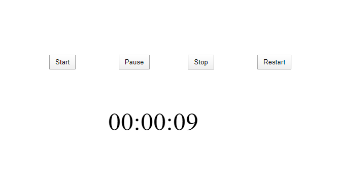

# stopwatch
A stopwatch created using JS. 

The user can press the start button to start the timer. 

The pause button can be used to pause the timer and again the start button can be clicked to start the timer from the exact point of time.

The stop button will completely stop the timer and pressing the start button will result in new timer being started.

Lastly, the user can use the reset button to reset the timer.

Demo: https://shovaaa.github.io/stopwatch/

